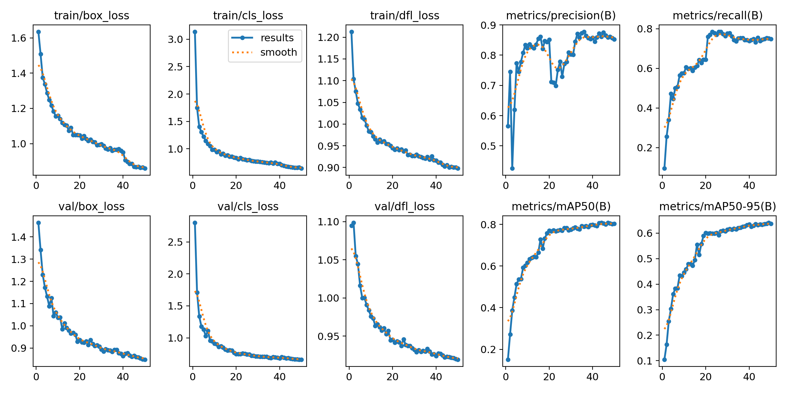
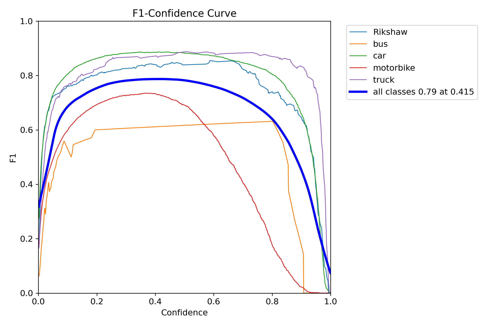
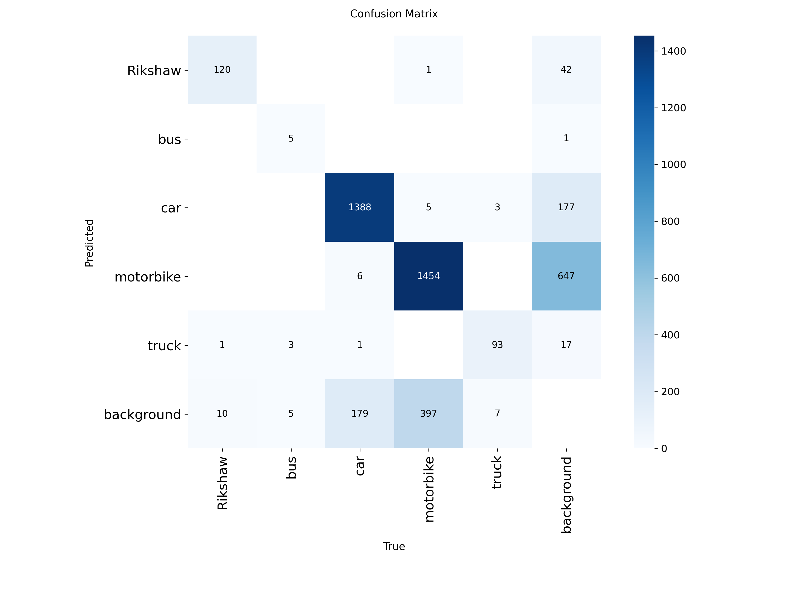

# Adaptive Smart Traffic Light System 🚦🧠

An intelligent, real-time traffic signal control system powered by Computer Vision (YOLOv8) that dynamically adjusts green light durations based on live vehicle density and types across a 4-way intersection.

---

## 📊 1. Dataset Information

The foundation of any good Computer Vision model is its dataset. For this project, a generic dataset was not sufficient because Indian traffic conditions (specifically the types of vehicles and lane discipline) are highly unique.

*   **Data Collection**: We manually collected live traffic footage and images specifically from various intersections in **Gandhinagar, Gujarat**.
*   **Dataset Size**: The dataset consists of over **700+ annotated images** extracted from these real-world traffic videos.
*   **Classes**: We manually annotated 5 distinct classes that are highly relevant to Indian roads:
    1.  `Car`
    2.  `Bus`
    3.  `Truck`
    4.  `Motorbike`
    5.  `Rikshaw` (Auto-rickshaws drastically affect traffic flow and are crucial for our PCU algorithm).

---

## 🛠️ 2. Training Process & Methodology

The model used is **YOLOv8** (You Only Look Once), chosen for its state-of-the-art real-time object detection capabilities. 

While YOLOv11 is newer, **YOLOv8** was strategically chosen for this specific engineering use case for several logical reasons:
1. **Computational Efficiency (Lightweight)**: Our system processes **4 concurrent video streams** simultaneously. YOLOv11 has a heavier architectural overhead. YOLOv8 offers an exceptional balance of high accuracy while remaining lightweight enough to maintain >30 FPS across multiple feeds on standard hardware.
2. **Edge Deployment Readiness**: Real-world traffic systems run on edge hardware (like NVIDIA Jetson Nanos) mounted on poles, not cloud servers. YOLOv8 has immense maturity and community support for highly optimized TensorRT/ONNX exports specifically meant for edge devices.
3. **Architectural Stability**: YOLOv8 is a battle-tested, production-ready framework, ensuring system stability without the bleeding-edge bugs often found in newly released architectures like v11.

### Train-Test Split
The dataset was carefully split to prevent data leakage and ensure the model generalizes well to new, unseen intersections:
*   **Training Set (80%)**: Used to train the YOLOv8 model weights.
*   **Validation Set (10%)**: Used during training to tune hyperparameters and prevent overfitting.
*   **Test Set (10%)**: Held out completely during training to evaluate final real-world performance.

### Training Configuration
*   **Framework**: Ultralytics YOLOv8
*   **Hardware**: Trained locally leveraging a dedicated NVIDIA GPU (CUDA) to accelerate tensor operations.
*   **Input Resolution**: Images were resized to `640x640` during training for optimal feature extraction, but inference runs at `320px` to maintain a strict >30 FPS real-time processing speed.

---

## 📈 3. Results & Metrics (Proof of Performance)

The model achieved excellent precision and recall across all 5 classes, proving its reliability for real-world traffic counting.

### Training Metrics (Results Graph)
Below is the training output graph showing the steady decrease in loss (box loss, objectness loss, and classification loss) alongside the increase in mAP (Mean Average Precision) over the epochs. For object detection, **mAP** acts as our primary accuracy metric.

*(Fig 1: YOLOv8 Training Results over epochs showing convergence and high mAP50-95 scores)*

### F1 Confidence Curve
The F1 score evaluates the harmonic mean of Precision and Recall. The curve below demonstrates the optimal confidence threshold where the model perfectly balances detecting as many vehicles as possible (Recall) without making false-positive predictions (Precision).

*(Fig 2: F1-Confidence Curve showing peak F1-Score across all vehicle classes)*

### Confusion Matrix
The confusion matrix below demonstrates the model's accuracy in distinguishing between similar classes (e.g., differentiating a large Car from an Auto-Rikshaw, or a Bus from a Truck).

*(Fig 3: Normalized Confusion Matrix showing high true-positive rates across all 5 classes)*

---

## 🧠 4. Algorithmic System Logic

Traditional traffic lights operate on fixed timers, leading to massive inefficiencies. This project solves that by calculating the exact "weight" of traffic in each lane and dynamically adjusting the cycle.

### A. The PCU (Passenger Car Unit) Algorithm
Not all vehicles take up the same space or clear an intersection at the same speed. We use PCU weights based on Indian road conditions:
*   `car`: 1.0 PCU
*   `Rikshaw`: 0.8 PCU
*   `motorbike`: 0.4 PCU
*   `bus`: 3.0 PCU
*   `truck`: 3.5 PCU

**Logic**: Total Lane Density = Sum of (Vehicle Count × PCU Weight).

### B. Adaptive Timing & Exponential Smoothing
*   **Time Allocation**: Every 1 PCU requires exactly 2.0 seconds of green light to cross. The allocated green time is mathematically clamped between `10s` (minimum) and `60s` (maximum).
*   **Anti-Jitter (Exponential Smoothing)**: Traffic is dynamic; vehicles temporarily block the camera. To prevent the timer from jumping wildly from frame to frame, the algorithm uses an **80/20 Weighted Smoothing** filter:
    `New PCU = (Previous Frame PCU * 0.8) + (Current Frame PCU * 0.2)`

---

## 💻 5. Current Progress & Live Dashboard

I am currently finalizing the **Real-Time WebSocket Dashboard**. 
Because running 4 concurrent video streams through a GPU can cause bottlenecks, I engineered a **Sequential Inference Sync Architecture**.

*   **Flask-SocketIO**: The backend processes lanes sequentially (`North -> East -> South -> West`) and streams the annotated frames, live counts, and signal state via low-latency WebSockets.
*   **Dual Mode**: The dashboard accepts either pre-recorded 4-way intersection MP4s **or** live camera feeds pushed from 4 paired smartphones.
*   **Frontend**: A clean, minimalist UI featuring a synchronized 2D HTML5 Canvas simulation of the intersection.

---

## 🚀 6. Future Plan
Moving forward, I plan to implement:
1. **Emergency Vehicle Preemption**: Train the model to specifically identify Ambulances and Fire Engines, allowing the system to instantly override the cycle and grant a green light to that specific lane.
2. **Cloud Database Analytics**: Log traffic density data over weeks/months to identify peak hours and allow city planners to optimize road layouts.
3. **Multi-Intersection Sync**: Connect multiple of these adaptive nodes together so they communicate. If Intersection A releases a massive wave of traffic, Intersection B (down the road) prepares by extending its green time proactively.

